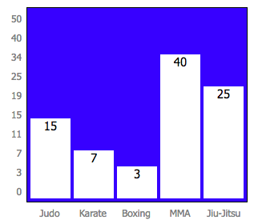
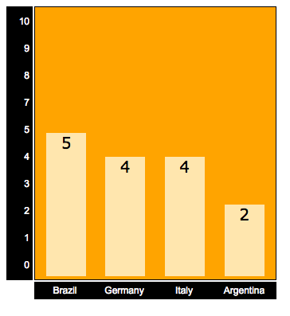

# About
**bar-chart-lib** is a Library that allow other devs to generate bar charts on web pages using HTML, CSS and JavaScript. It's a tool to make easy to create and display a simple bar chart after some data and options information.

# Screenshots
Examples of charts that you can create with this API:

# How to Use
Just call the function `drawBarChart(data, options, element);` where:

`data`: Multidimensional Array with labels (axis x) and values (axis y), as the examples above:

var data = [ ['Bob',10], ['Rick',15], ['Sarah',20] ];

Where Bob = 10, Rick = 15 and Sarah = 20;

`options`: Object with all options parameters that you need to customize your bar chart. More details in topic **Options Parameters**

`element`: Will be `null` when you just want to display the bar chart in the html page but if you need to show this chart in some specific html element, just put this name on it.

# Options Parameters

Example:

    var options = {

      // chart
      chart_width: 350,
      chart_height: 300,
      chart_font_face: 'verdana',
      chart_font_color: 'green',
      chart_font_size: 12,
      chart_bgcolor: 'white',
      bar_bgcolor: 'lightgreen',

      // axis-x
      x_font_face: 'verdana',
      x_font_color: 'white',
      x_font_size: 11,
      x_bgcolor: 'black',

      // axis-y
      y_quantity: 10,
      y_low_limit: 0,
      y_high_limit: 100,
      y_font_face: 'verdana',
      y_font_color: 'white',
      y_font_size: 11,
      y_bgcolor: 'black'

    }

Where:
 
- `chart_width` = Width of all the chart area (in pixels)
- `chart_height` = Height of all the chart area (in pixels)
- `chart_font_face` = Font-family used in all the chart area (example: Verdana, Tahoma, Arial)
- `chart_font_color` = Color of this font-family (RGB, name or HEX)
- `chart_font_size` = Size of the font-family (in pixels)
- `chart_bgcolor` = Color of the background of the chart area
- `bar_bgcolor` = Color of the bars of the chart area

- `x_font_face` = Font-family of the Axis X
- `x_font_color` = Color of the font in Axis X
- `x_font_size` = Size of the font in Axis X
- `x_bgcolor` = Background color of the Axis X

- `y_font_face` = Font-family of the Axis Y
- `y_font_color` = Color of the font in Axis Y
- `y_font_size` = Size of the font in Axis Y
- `y_bgcolor` = Background color of the Axis Y

- `y_quantity` = Quantity of values in Axis Y
- `y_low_limit` = Lower limit in Axis Y (should be higher or equal 0)
- `y_high_limit` = Higher limit in Axis Y

# Issues / Bugs
- ESLint support (i couldn't setup this correctly yet. I know, this is sad);

# Features to be implemented
- Increase the options for the element that you point to, like position of this element, borders, colors and fonts;
- Increase the options for the chart, like title and space between another chart;
- Possibility to manipulate the axis, inverting the chart;
- Possibility to insert multiple values for each bar;
- Consider negative numbers in Axis of values;

# External Resources
[W3Schools - JavaScript](https://www.w3schools.com/js/default.asp)
